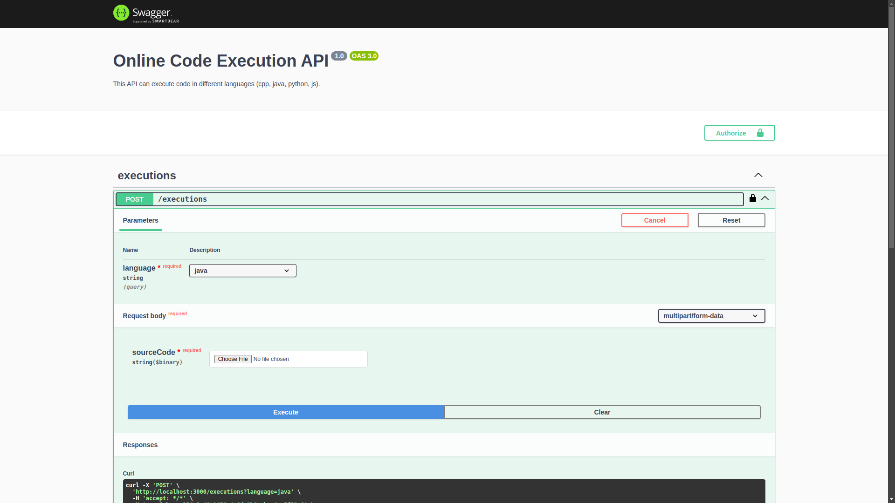

# Code Execution API

This is an API that can execute code in the following languages: Java, Python, C++, and JavaScript. When you log in and execute the code, it will be stored for 7 days from the last execution.

# Key Technologies

The project is built using the following technologies:

- **1. Node.js**: Backend runtime environment.
- **2. NestJS**: A progressive Node.js framework for building efficient and scalable server-side applications.
- **3. PostgreSQL**: Relational database management system.
- **4. Redis**: In-memory data store used for caching.
- **5. JWT (JSON Web Tokens)**: For secure authentication and authorization.
- **6. Docker**: Containerization for isolating the application environment.
- **7. Swagger**: Used for API documentation and testing, providing an interactive interface to explore and test the API endpoints.
- **8. Unit Testing**: Jest is used for writing and running unit tests to ensure code quality and correctness.
- **9. E2E Testing**: End-to-end testing is implemented using Jest to simulate real-world use cases and validate the entire flow.

# Getting Started

## Requirements

Before setting up the project, ensure you have the following installed on your system:

- **1. Docker**: The application uses Docker containers for deployment and execution. Make sure Docker is installed and running on your system. You can download Docker from [here](https://www.docker.com/get-started).

- **2. Node.js (v20 or higher)**: The project requires Node.js version 20 or higher. You can download and install Node.js from [here](https://nodejs.org/).
  > **Note**: Due to a limitation with mounting volumes in the Docker socket, the API will temporarily run on the host machine's Node.js instead of inside a container. This issue will be fixed in a future release.

To check if Node.js is installed and verify its version, run the following command:

```bash
node -v
```

## Environment Variables

To run this project, you will need to add the following environment variables to your .env file

```bash
# Database configuration
DATABASE_HOST=localhost
DATABASE_PORT=5432
DATABASE_USERNAME=postgres
DATABASE_PASSWORD=postgres
DATABASE_NAME=db
DATABASE_SYNCHRONIZE=true

# Redis configuration
REDIS_HOST=localhost
REDIS_PORT=6379
REDIS_TTL=604800000  # Time to live in milliseconds (7 days)

# JWT configuration
JWT_SECRET_KEY=7f29f3f86b204f2f9b1b72b2d735a9cd6b873b42a2e60d1a5a7be6f5584ff056b2f3c4a9f64e198a193d1e6cb7380f127431c4e8e720e074cbb6f819f0a85c94
JWT_EXPIRATION=60m  # Token expiration time

# API configuration
API_KEY=254a3c48-1456-4a8d-9b6c-bec4aa5f23a9
API_PORT=3000
API_PREFIX=api
API_VERSION=v1
```

## Running the project

To run the project, follow these steps:

- **1. Start PostgreSQL and Redis**: Use Docker Compose to spin up the necessary services (Postgres and Redis).

```bash
docker-compose up
```

- **2. Set up necessary Docker images**: Run the following command to ensure that the required Docker images for execution are set up correctly.

```bash
chmod +x ./setup-image.sh && ./setup-image.sh
```

- **3. Run the API**: Once the services and images are ready, you can start the API using the following command:

```bash
npm run start
```

# Running Tests

To run tests, run the following command:

- **1. Unit Test**:

```bash
  npm run test
```

- **2. E2E Test**:

```bash
  # Set up
  docker compose up

  # E2E test 'UsersController'
  npm run test:e2e:users

  # E2E test 'ExecutionsController'
  npm run test:e2e:executions
```

# API Documentation

- **1. Open link**: [http://localhost:3000/api/v1/docs](http://localhost:3000/api/v1/docs)

- **2. Screen Short**:
  
